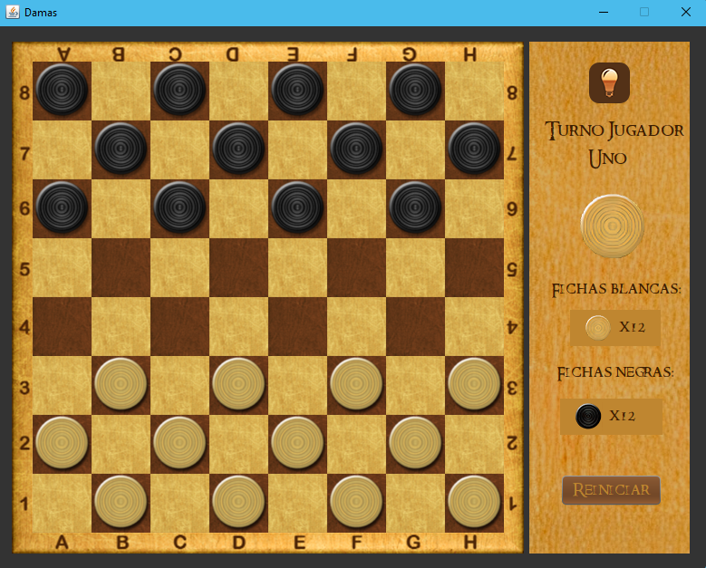

# JuegoDamas_Java
Es un proyecto de la universidad que consistía en la creación de un videojuego haciendo uso del paradigma de la programación orientada a objetos con Java.

Imagen de la interfaz del juego:

